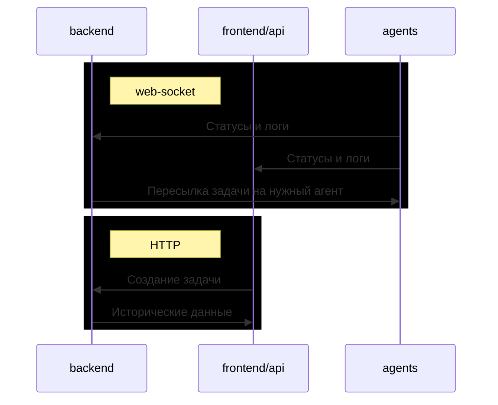

Схема связей микросервисов (фронтэнд и бэкэнд разделены для удобства

```mermaid
sequenceDiagram
participant backend
participant frontend/api
participant agents
rect rgb(0, 0, 0)
    note right of backend: web-socket
    agents->>backend: Статусы и логи
    agents->>frontend/api: Статусы и логи
    backend->>agents: Пересылка задачи на нужный агент
end

rect rgb(0, 0, 0)
    note right of backend: HTTP
    frontend/api->>backend: Создание задачи
    backend->>frontend/api: Исторические данные
end

 
```
